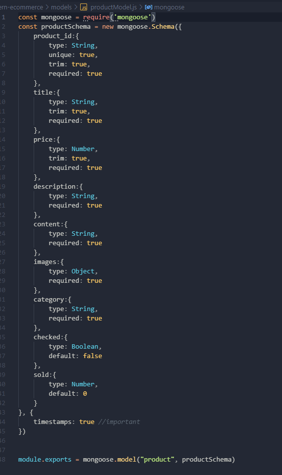

<center>Welcome To DATV</center>
Follow me ==> https://github.com/CompanyDATV <br>

Contact me ==>  [DATV](https://companydatv.github.io/MyCV/)

# This is my project about Ecommerce 

* In this project i use Frontend which is Reactjs with Html & CSS
* Beside i using Nodejs and Database MongoDB for Backend!!!

#Ok!

First one ==> we need dowload repository here !!!
    
    command line: git clone https://github.com/CompanyDATV/Ecommerce-DATV.git
After using vscode to open Project Ecommerce-DATV

run repo with command line==>

<p style='color:red'>We need to install the following libraries</p>

+  npm i express express-session express-ejs-layouts connect-flash passport passport-local mongoose bcrypt ejs <br>

And ==>
```js
// command line with  Server : ==> npm run server 
//    and client command line:     npm start
```

Ok !!!

<center>Now we see website auto run with port 3000</center>
- But where us using Port = 4000


<br>


# let's see our Database side with : account :
<p align="center">
  
  
</p>

```html
// same 
```
Beside we have Auth ===>

# Slove ==> 

### Server ==> ###

        mongoose.connect(URI, {
            useCreateIndex: true,
            useFindAndModify: false,
            useNewUrlParser: true,
            useUnifiedTopology: true
        }, err =>{
            if(err) throw err;
            console.log('Connected to MongoDB')
        })

brove is dbs connect server   || using function => : api :

        app.use('/user', require('./routes/userRouter'))
        app.use('/api', require('./routes/categoryRouter'))
        app.use('/api', require('./routes/upload'))
        app.use('/api', require('./routes/productRouter'))
        app.use('/api', require('./routes/paymentRouter'))

<center>Upload file Client!!!</center>
* using : cloudinary :

Code : 
### upload 
        router.post('/upload',auth , authAdmin, (req, res) =>{
            try {
                if(!req.files || Object.keys(req.files).length === 0)
                    return res.status(400).json({msg: 'No files were uploaded.'})
                
                const file = req.files.file;
                if(file.size > 1024*1024) {
                    removeTmp(file.tempFilePath)
                    return res.status(400).json({msg: "Size too large"})
                }

                if(file.mimetype !== 'image/jpeg' && file.mimetype !== 'image/png'){
                    removeTmp(file.tempFilePath)
                    return res.status(400).json({msg: "File format is incorrect."})
                }

                cloudinary.v2.uploader.upload(file.tempFilePath, {folder: "test"}, async(err, result)=>{
                    if(err) throw err;

                    removeTmp(file.tempFilePath)

                    res.json({public_id: result.public_id, url: result.secure_url})
                })


            } catch (err) {
                return res.status(500).json({msg: err.message})
            }
        })

### Delete image - upload 
        router.post('/destroy',auth , authAdmin, (req, res) =>{
            try {
                const {public_id} = req.body;
                if(!public_id) return res.status(400).json({msg: 'No images Selected'})

                cloudinary.v2.uploader.destroy(public_id, async(err, result) =>{
                    if(err) throw err;

                    res.json({msg: "Deleted Image"})
                })

            } catch (err) {
                return res.status(500).json({msg: err.message})
            }
            
        })
        const removeTmp = (path) =>{
            fs.unlink(path, err=>{
                if(err) throw err;
            })
        }

# About Authorizator 

* Using Auth with Account


-:)

    const auth = (req, res, next) =>{
        try {
            const token = req.header("Authorization")
            if(!token) return res.status(400).json({msg: "Invalid Authentication"})

            jwt.verify(token, process.env.ACCESS_TOKEN_SECRET, (err, user) =>{
                if(err) return res.status(400).json({msg: "Invalid Authentication"})

                req.user = user
                next()
            })
        } catch (err) {
            return res.status(500).json({msg: err.message})
        }
    }

    
* Using Auth with Admin

*-*

    const authAdmin = async (req, res, next) =>{
        try {
            // Get user information by id
            const user = await Users.findOne({
                _id: req.user.id
            })
            if(user.role === 0)
                return res.status(400).json({msg: "Admin resources access denied"})

            next()
            
        } catch (err) {
            return res.status(500).json({msg: err.message})
        }
    }

<center>Thanks for Watching</center>
